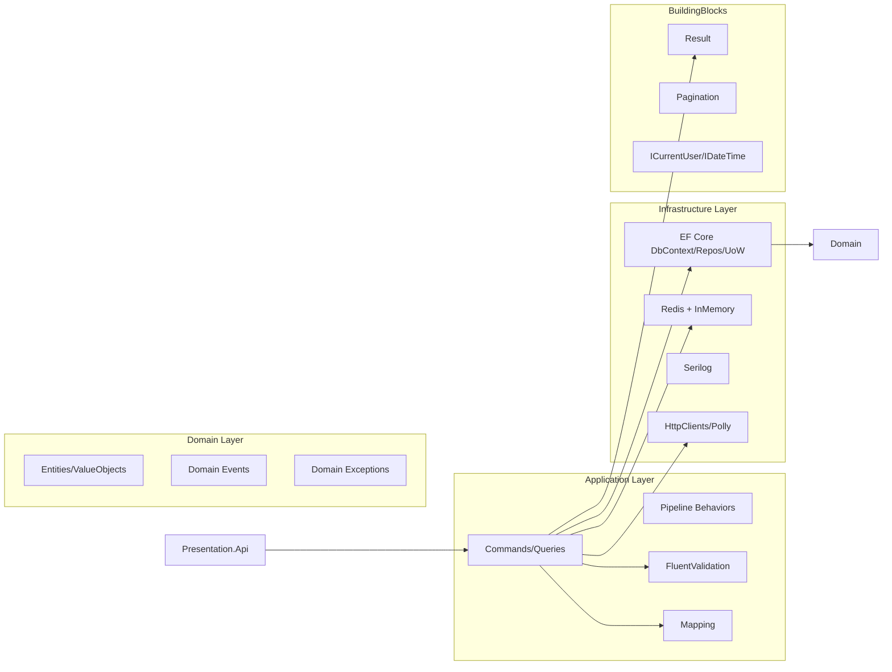

# CleanArchTemplate (.NET 9)

## Overview
Enterprise-grade Clean Architecture template for .NET 9 using Onion Architecture, CQRS with MediatR, EF Core (SQL Server), Redis caching with in-memory fallback, and Serilog shipped to Console/File and optionally Elasticsearch.



## Project Layout
```
/src
  /Presentation.Api
  /Application
  /Domain
  /Infrastructure
  /Infrastructure.Persistence
  /BuildingBlocks
/tests
  /UnitTests
  /IntegrationTests
/docker
  docker-compose.yml
```

- `Presentation.Api`: Controllers, DI, middleware, ProblemDetails, Swagger, auth, health checks.
- `Application`: CQRS (MediatR), validators, mapping, interfaces.
- `Domain`: Entities, value objects, domain events.
- `Infrastructure`: Caching, logging, external services, OpenTelemetry.
- `Infrastructure.Persistence`: EF Core DbContext, configurations, repositories, Unit of Work, migrations.
- `BuildingBlocks`: Result<T>, pagination, abstractions.

## Getting Started
Prerequisites: .NET 9 SDK, Docker, Bash/PowerShell.

Quick start:
```
cp .env.example .env
docker compose -f docker/docker-compose.yml up -d
/workspace/.dotnet/dotnet restore
/workspace/.dotnet/dotnet ef database update --project src/Infrastructure.Persistence
/workspace/.dotnet/dotnet run --project src/Presentation.Api
```
Swagger: `http://localhost:8080/swagger`

## Configuration
`src/Presentation.Api/appsettings.json` keys:
- `ConnectionStrings:SqlServer`
- `Redis:ConnectionString`, `Redis:Enabled`
- `Serilog` (levels, sinks, optional `Serilog:Elasticsearch:Uri`)
- `Jwt` (Issuer, Audience, Key)
- `ExternalServices:WeatherProvider:BaseUrl`

Redis unreachable -> in-memory fallback with warning log. Elasticsearch unreachable -> logs continue to Console/File.

## Logging & Observability
- Serilog request logging
- Enrichers for environment, process and thread
- Optional OpenTelemetry tracing scaffolded
- Elasticsearch/Kibana supported via docker-compose

## Caching Behavior
- Abstraction `ICacheService`
- Methods: GetOrSetAsync, RemoveByPatternAsync
- Keys (examples): `weather:byId:{id}`, `weather:list:{filters}`
- Writes invalidate with prefix `weather:`

## Health Checks
- Liveness: `/health`
- Readiness: `/ready`
- Includes SQL Server, Redis, Elasticsearch checks (packages included; register as needed)

## Weather Module
Endpoints (v1):
- POST `/api/v1/weather`
- GET `/api/v1/weather/{id}`
- GET `/api/v1/weather?locationId=&from=&to=&search=&page=&pageSize=`
- PUT `/api/v1/weather/{id}`
- DELETE `/api/v1/weather/{id}`

Sample request (create):
```json
{
  "locationId": "00000000-0000-0000-0000-000000000001",
  "date": "2025-08-17",
  "temperatureC": 25,
  "summary": "Sunny"
}
```

Pagination example: `/api/v1/weather?page=2&pageSize=50&search=sun`

## Migrations/Seeding
Generate migration:
```
/workspace/.dotnet/dotnet ef migrations add Initial --project src/Infrastructure.Persistence --startup-project src/Presentation.Api
```
Apply:
```
/workspace/.dotnet/dotnet ef database update --project src/Infrastructure.Persistence --startup-project src/Presentation.Api
```

## Tests
Run unit and integration tests:
```
/workspace/.dotnet/dotnet test --collect:"XPlat Code Coverage"
```
Integration tests can use Testcontainers (SQL/Redis) or swap for SQLite for speed.

## Common Tasks
- Add feature slice: Domain entity -> Application commands/queries + validators -> Controller.
- Add external service: register typed `HttpClient` with Polly in `Infrastructure`.
- Add cacheable query: wrap handler with `ICacheService.GetOrSetAsync` and invalidate on related commands.

## Security Note
JWT settings are for demo only. Do not ship dev secrets to prod; use KeyVault/managed identities.

## Roadmap & Extensibility
- Background jobs (Hangfire)
- Outbox + Inbox pattern for reliability
- Domain notifications
- Multi-tenancy
- Pipeline behaviors (Validation/Logging/Caching/Performance) can be added in `Application` easily.